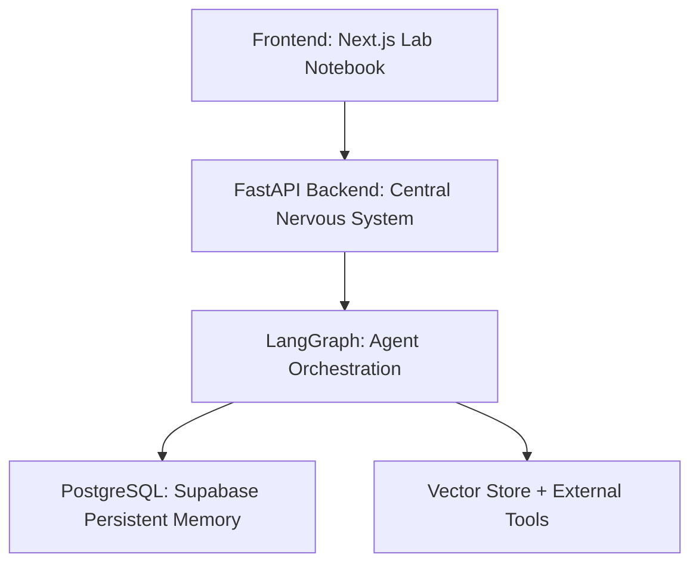

# 🧪 Aiversehack01 — The Career Scientist

**An Agentic AI System for Evidence-Driven Career Growth**

---

## 🚀 Overview

**Aiversehack01** is an Agentic AI Career Development Assistant that treats career growth as a scientific experiment, not a guessing game.

Instead of static advice, resume scoring, or one-off chatbots, this system:
- **Forms hypotheses** about a user’s career readiness.
- **Executes real-world experiments** (applications, learning sprints, projects).
- **Learns from outcomes** such as rejections, ghosting, and feedback.
- **Continuously updates its strategy** using a persistent belief state.

**Core Idea:** Rejections are not failures — they are valuable **data points** for optimization.

---

## 🎯 Problem Statement

Students and early-career professionals face:
- 🌫️ **Unclear job readiness** ("Am I actually good enough for Series A startups?").
- 🎲 **Random learning paths** driven by hype rather than market signals.
- 🔁 **Repeated rejections** with no actionable feedback loop.
- 🛠️ **Fragmented tools** that don’t learn over time.

Career growth today requires manual reasoning, while existing tools remain stateless.

## 💡 Solution

Aiversehack01 is a long-term **AI Career Scientist** that maintains a persistent model of you. It:
1. **Understands** your evolving career profile via Evidence Ingestion.
2. **Reasons** about job market requirements vs. your actual skills.
3. **Plans** personalized, adaptive skill roadmaps.
4. **Acts** on opportunities (jobs, internships, hackathons).
5. **Learns** continuously from every outcome.

**This is not a chatbot.** This is an autonomous career reasoning system.

---

## 🧠 Core Philosophy: "Your Career as a Science Experiment"

Every career move is modeled as part of a rigorous protocol:
1.  **Hypothesis**: *"If I apply to this Senior Backend role, my Python skills will be validated."*
2.  **Experiment**: The actual application or project submission.
3.  **Outcome**: Rejection, Interview, or Offer.
4.  **Belief Update**: The AI adjusts its confidence in your skills (e.g., Python confidence drops from 70% -> 65%).
5.  **Replanning**: The strategy evolves automatically (e.g., *" pivot to Mid-level Data Engineering"*).

---

## 🧩 Key Differentiators (Novelty)

### 1. Belief-State Career Model
Skills are stored as **probabilistic beliefs**, not binary flags.
| Traditional Tools | Aiversehack01 |
| :--- | :--- |
| "Python: Yes" | "Python: **65% confidence**, backed by GitHub commit history + 2 failed interviews" |

### 2. Rejection-Driven Learning Loop
Rejections trigger:
- Belief confidence updates.
- Strategy versioning.
- Role or skill pivot suggestions.

### 3. Hypothesis-Based Planning
Every recommendation answers:
- *What are we testing?*
- *Why this action?*
- *What signal will confirm or reject it?*

### 4. Persistent Career Memory
The system remembers past applications, skill evolution, and failed strategies, enabling long-term autonomy rather than session-level responses.

---

## 🏗️ System Architecture

### High-Level Architecture


### ⚙️ Tech Stack

#### **Backend (The Brain)**
- **FastAPI**: High-performance API server.
- **LangGraph**: Stateful agent orchestration and graph logic.
- **LangChain**: Tool and LLM integrations.
- **Pydantic**: Strict schemas for AI outputs.
- **SQLAlchemy + Psycopg2**: Database ORM.
- **Supabase (Postgres)**: Fully managed persistent database.
- **Analysis Tools**: DuckDuckGo Search, BeautifulSoup, PyPDF2, PyGithub.

#### **Frontend (The Lab Notebook)**
- **Next.js 15 (App Router)** & **React 19**.
- **Tailwind CSS**: Utility-first styling.
- **Recharts**: For visualizing skill confidence intervals.
- **Framer Motion**: Smooth UI transitions.
- **NextAuth.js**: GitHub authentication.

---

## 🤖 Multi-Agent System Design

1.  **Intake & Evidence Agent**: Parses Resume/GitHub to build the initial "Belief State".
2.  **Career Reasoning Agent**: "Is my Python enough for an SWE internship?" (Market Realism).
3.  **Hypothesis / Planner Agent**: Decides the next best action (Roadmaps, Strategy Versioning).
4.  **Action Agent**: Reduces manual effort (Job recommendations, Resume tailoring).
5.  **Reflection & Learning Agent**: Analyzes outcomes (Rejections) to update beliefs.

---

## 🔄 End-to-End Workflow

1.  **User logs in** (Persistent account via GitHub).
2.  **Ingestion**: Uploads resume + GitHub (First-time users).
3.  **Synthesis**: Career beliefs are initialized (e.g., Python: 70%, ML: 45%).
4.  **Planning**: Hypotheses are generated ("Test ML fit via Hackathons").
5.  **Action**: User runs the experiment.
6.  **Learning**: Outcomes are observed; Beliefs update; Strategy evolves.

---

## 🧑‍🔬 User Interface Concept

-   **Career Passport**: Your live "Character Sheet" showing skill beliefs + confidence.
-   **Experiments Dashboard**: Kanban board of active hypotheses and applications.
-   **Insights Log**: A journal of what the AI has learned from your failures.
-   **Guidebot**: An evidence-grounded Q&A assistant living in the dashboard.

---

## 🛠️ Getting Started (Local Development)

### Prerequisites
- Python 3.10+
- Node.js 18+
- Supabase Account (or local Postgres)
- GitHub OAuth App Credentials

### 1. Environment Setup
Create a `.env` file in **root** (for backend) and `frontend/.env` (for frontend).
Refer to `.env.example` in the root.

### 2. Start the Backend (The Brain)
From the project root (`aiversehack01/`):
```bash
python -m uvicorn backend.main:app --reload
```
*Server runs on `http://localhost:8000`*

### 3. Start the Frontend (The Lab)
From the `frontend/` directory:
```bash
cd frontend
npm install
npm run dev
```
*UI runs on `http://localhost:3000`*

---

## 📊 Evaluation Alignment

-   **Architecture & Autonomy (40%)**: Stateful agent orchestration, persistent memory, autonomous replanning.
-   **User Experience (20%)**: Notebook-style UI, complex reasoning hidden behind clarity.
-   **Innovation & Adaptability (20%)**: Hypothesis-driven design, rejection-as-data philosophy.
-   **Impact & Alignment (20%)**: Democratizes mentorship, scales career intelligence.

---

## ⚠️ Limitations & Honest Critique
-   **Data Sparsity**: Early stage needs more user data to converge beliefs.
-   **Signal Noise**: "Ghosting" by companies is a hard signal to interpret.
-   **User Engagement**: Requires the user to actively "run" the experiments.

*Why it still works: Probabilistic beliefs handle this uncertainty better than static rules.*

---

## 🧭 Vision
Aiversehack01 is not just a career tool. It is a **Decision Scientist framework** that can expand into:
-   Academic planning
-   Research guidance
-   Startup validation
-   Skill certification systems

---

## 📜 License
MIT License

## 🤝 Contributors
Built for **Aiversehack01 Hackathon** by a team exploring Agentic AI beyond chatbots.
